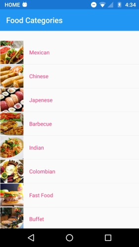
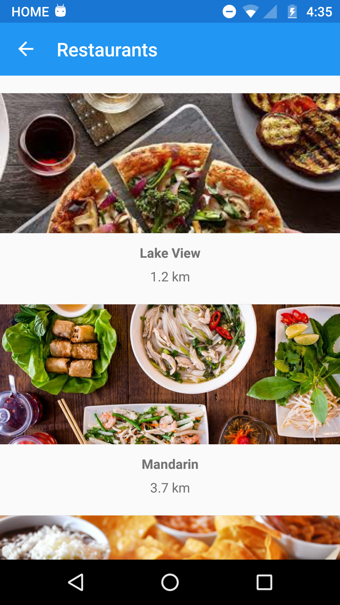
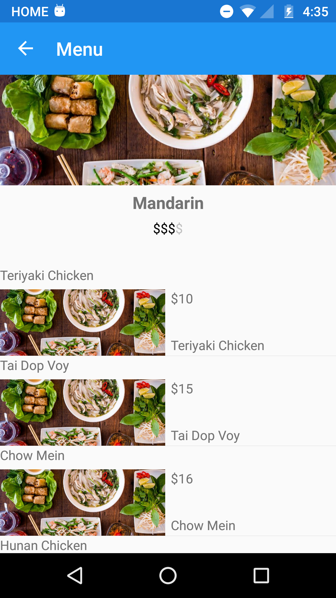
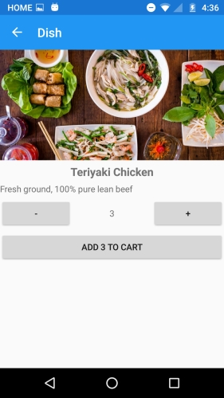
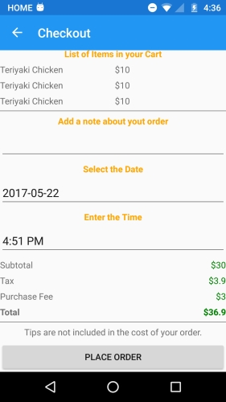

# Messero Mobile
===========

A Cross-Platform created as a personal project. It is the front-end of a mobile application to find and place food orders to restaurants.

Written in C# with ([Xamarin.Forms](http://www.xamarin.com)) 

Open Source Project by Esteban Verbel

Copyright 2017 

ScreenShots Messero Mobile
===========

Food Categories (Main Page)

Restaurants Page

Restaurant Menu (I am re-using the restaurant image for the dishes)

Food Item (Plate)

Checkout Page

