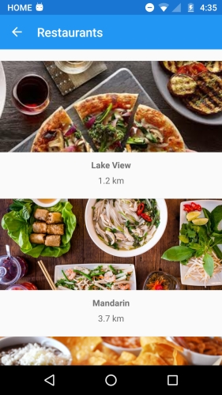
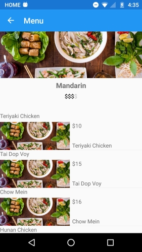

# Messero Mobile

A Cross-Platform mobile application, with a base PCL library created as a personal project. It is the front-end of a mobile application to find and place food orders to restaurants.

Written in C# with ([Xamarin.Forms](http://www.xamarin.com/forms)) 

Open Source Project by Esteban Verbel

Copyright 2017 

Built with C# 6 features, you must be running VS 2015+ or Xamarin Studio to compile.

ScreenShots
===========

#### Food Categories (Main Page)

#### Restaurants Page

#### Restaurant Menu (I am re-using the restaurant image for the dishes)

#### Food Item (Plate)

#### Checkout Page

## How much code is shared?

About 90% of the code is shared for Android and iOS. All of the Models, Services, View Models, Views, and helper classes are all found in one single PCL library.

## Note

The iOS postion of the priject has not been tested.

## License
The MIT License (MIT)

Copyright (c) Esteban Verbel

Permission is hereby granted, free of charge, to any person obtaining a copy of
this software and associated documentation files (the "Software"), to deal in
the Software without restriction, including without limitation the rights to
use, copy, modify, merge, publish, distribute, sublicense, and/or sell copies of
the Software, and to permit persons to whom the Software is furnished to do so,
subject to the following conditions:

The above copyright notice and this permission notice shall be included in all
copies or substantial portions of the Software.

THE SOFTWARE IS PROVIDED "AS IS", WITHOUT WARRANTY OF ANY KIND, EXPRESS OR
IMPLIED, INCLUDING BUT NOT LIMITED TO THE WARRANTIES OF MERCHANTABILITY, FITNESS
FOR A PARTICULAR PURPOSE AND NONINFRINGEMENT. IN NO EVENT SHALL THE AUTHORS OR
COPYRIGHT HOLDERS BE LIABLE FOR ANY CLAIM, DAMAGES OR OTHER LIABILITY, WHETHER
IN AN ACTION OF CONTRACT, TORT OR OTHERWISE, ARISING FROM, OUT OF OR IN
CONNECTION WITH THE SOFTWARE OR THE USE OR OTHER DEALINGS IN THE SOFTWARE.
